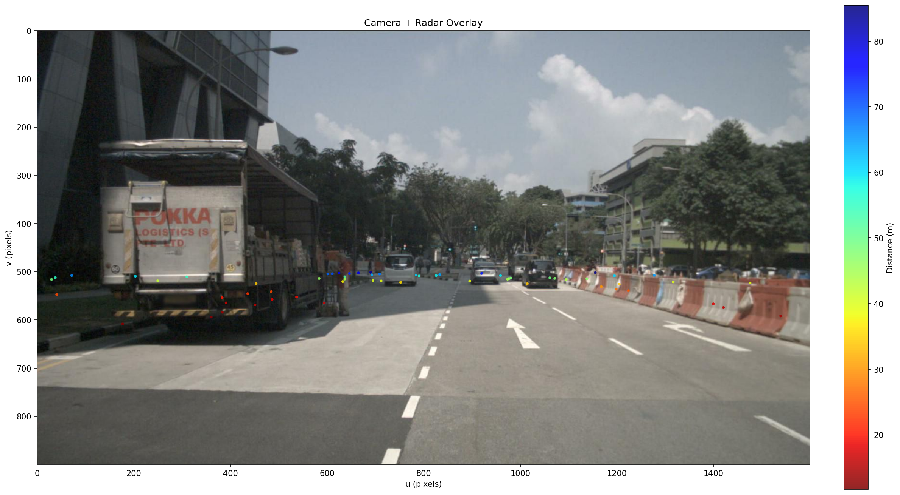
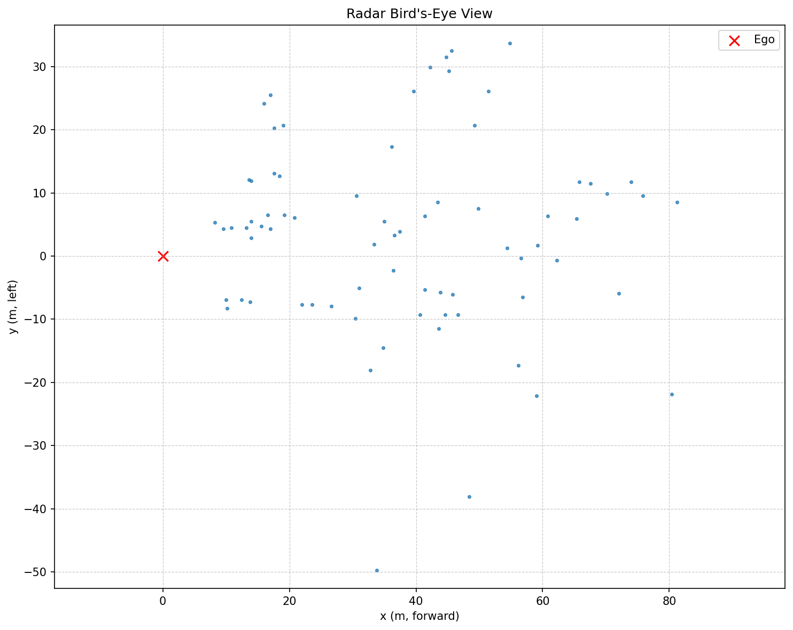
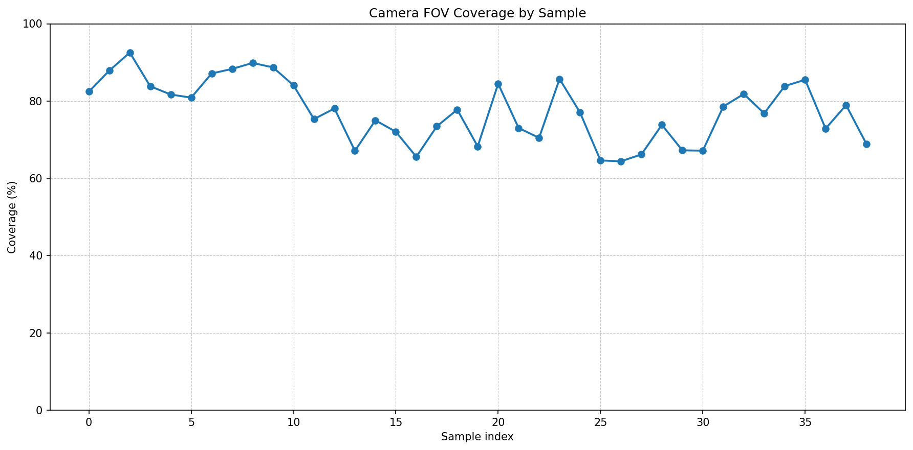

# AV Sensor Fusion
### Camera–Radar Sensor Fusion Pipeline on the nuScenes Dataset




Motivation
----------
Autonomous vehicles rely on multi-modal perception because no single sensor
captures the full picture. This project demonstrates camera–radar fusion on the
nuScenes mini dataset, projecting radar returns into the camera view and
quantifying coverage.

Features
--------
- Multi-sensor data loading (camera + radar)
- Three-stage coordinate transformation (radar → ego → camera → image)
- End-to-end radar projection pipeline
- Sensor coverage and range distribution analysis
- Visualisation suite (overlays, bird's eye, histograms)
- Scene-level statistical analysis with JSON output
- 13 unit tests covering core math

Architecture
------------
```
nuScenes Data -> Data Loader -> Coordinate Transforms -> Radar Projection -> Visualisation + Statistics
```

Sample Results
--------------
| Camera + Radar fusion overlay | Radar bird's-eye view | FOV coverage across a scene |
| --- | --- | --- |
|  |  |  |

- Camera + Radar fusion overlay shows projected radar returns aligned to image pixels.
- Radar bird's-eye view highlights the spatial distribution of detections in ego space.
- FOV coverage across a scene visualizes the percentage of radar points landing in view.

Installation
------------
```bash
git clone https://github.com/330012/av-sensor-fusion
cd av-sensor-fusion
python -m venv .venv
.venv\Scripts\activate    # Windows
source .venv/bin/activate # macOS/Linux
pip install -r requirements.txt
```

Dataset Setup
-------------
Download the nuScenes mini dataset and extract it to data/nuscenes/ with the
following structure:

```
data/
	nuscenes/
		maps/
		samples/
		sweeps/
		v1.0-mini/
```

Usage
-----
```bash
# Run full pipeline on scene 0
python -m scripts.main --scene-index 0 --num-frames 5

# See all options
python -m scripts.main --help
```

Project Structure
-----------------
```
av-sensor-fusion/
	data/        nuScenes dataset (gitignored)
	notebooks/   exploratory notebooks
	outputs/     generated figures and stats (gitignored)
	scripts/     pipeline modules and CLI
	tests/       unit tests
```

Running Tests
-------------
```bash
pytest tests/ -v
```
13 tests covering coordinate transforms, radar projection, data loading, and statistics.

Key Learnings
------------
- Sensor coordinate frames and quaternion-based transforms
- Pinhole camera projection model
- Cross-modal sensor alignment fundamentals
- Statistical analysis of sensor coverage

References
----------
- nuScenes paper: https://arxiv.org/abs/1903.11027
- nuScenes devkit: https://github.com/nutonomy/nuscenes-devkit
- CARIAD perception research focus

Author
------
**Gaurav Dineshbhai Khunt**
LinkedIn: https://www.linkedin.com/in/gauravkhunt
Email: gauravkhunt110@gmail.com

License
-------
MIT License (see LICENSE).
